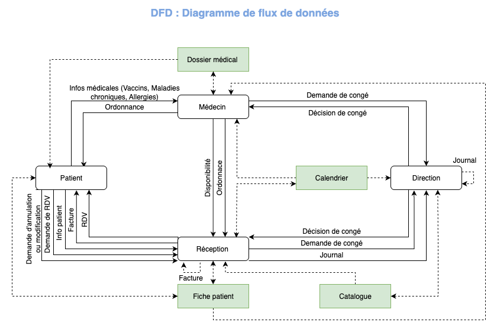
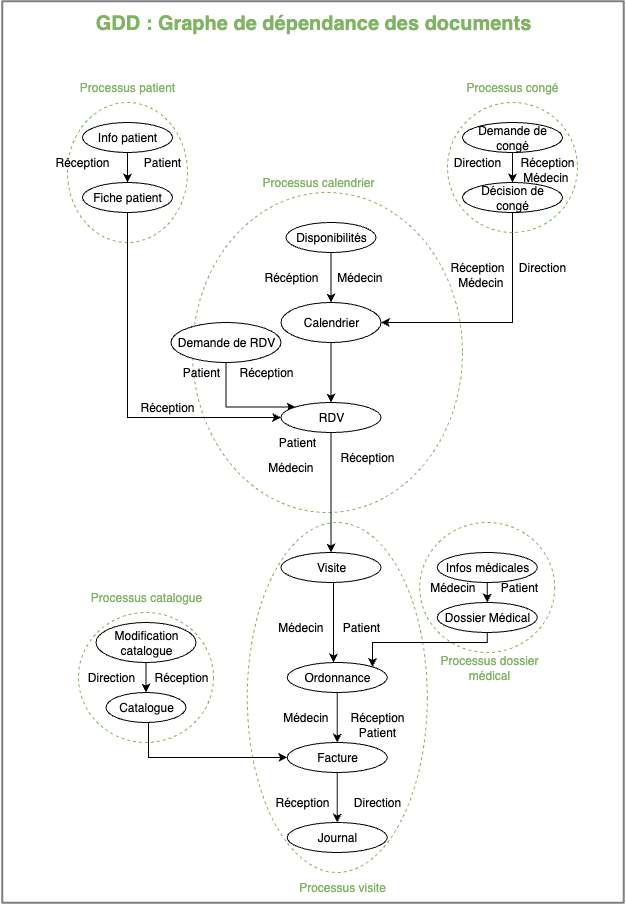
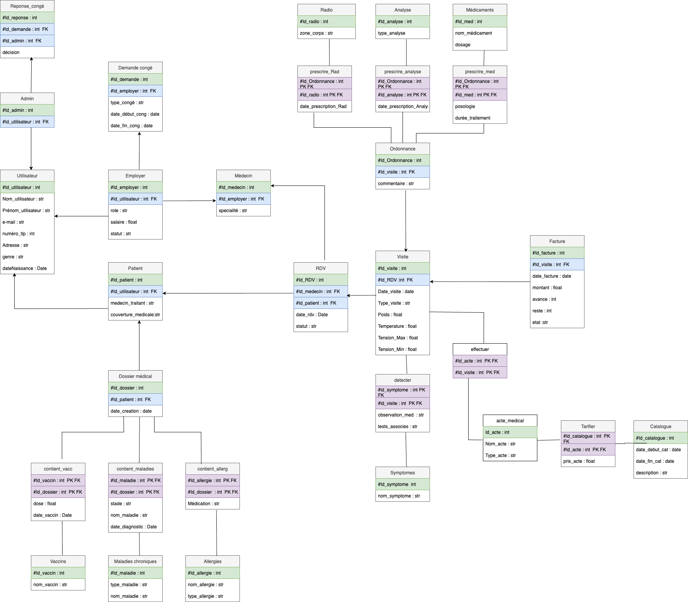
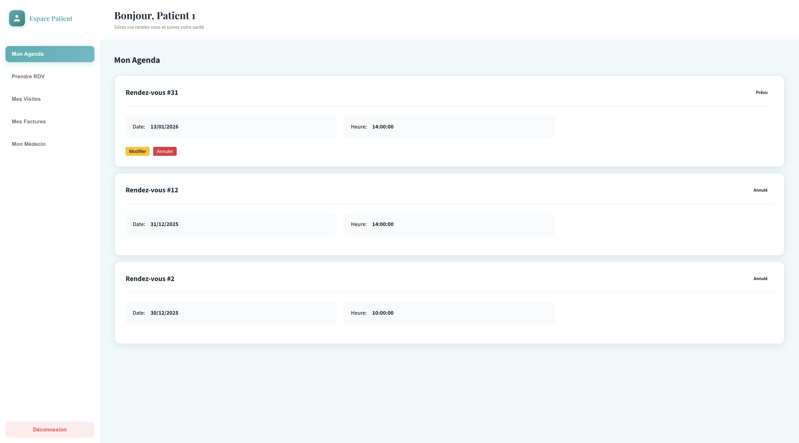
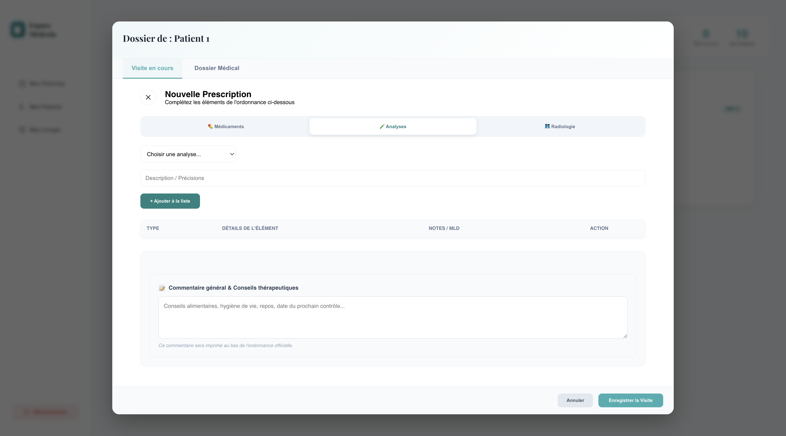
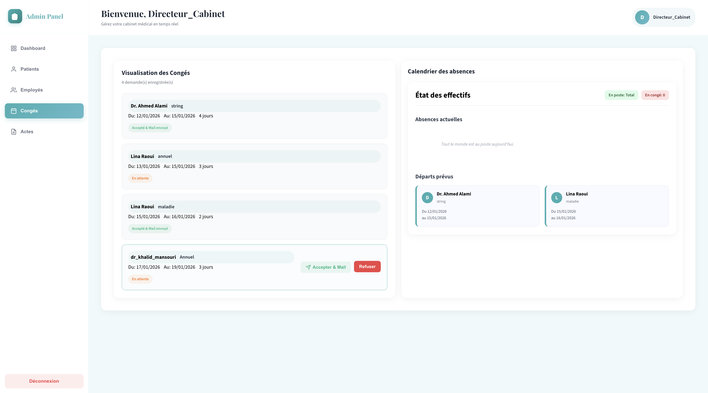

# Système de gestion de cabinet médical

La gestion manuelle d’un cabinet médical engendre des flux d'informations complexes, augmentant le risque d'erreurs, de pertes de données et d'inefficacité opérationnelle. Face à ces enjeux, la transformation numérique devient un levier indispensable pour optimiser la prise en charge des patients.

## Objectifs
Nous avons conçu un système d'information dédié à l'automatisation des processus cliniques. Ce projet vise à réduire la marge d’erreur humaine, à fluidifier l'accès aux soins et à centraliser l'historique médical des patients.

La réussite de ce projet repose sur une démarche structurée en trois phases clés :

- **Analyse du besoin :** Identification précise des acteurs et des flux de données.

- **Conception rigoureuse :** Modélisation des processus métier via des diagrammes de flux et de données.

- **Implémentation technique :** Développement d'une plateforme robuste avec une interface utilisateur dynamique et sécurisée.

## Analyse et Conception 


- **Flux de données (DFD) :** Le DFD explique comment l'information circule entre les patients, les médecins, la direction et le système.



- **Dépendances des Données (GDD) :** illustre les intérdépendances entre les 6 processus que gère notre application.



- **Modèle Logique des Données (MLD) :** détaille les tables,
les colonnes et les clés primaires et étrangères et donne la structure de la base de donnée MySQL.




### Stack Technique

- Frontend : React (Gestion de l'interface utilisateur).

- Backend : FastAPI (API REST rapide et documentée via Swagger).

- Base de données : MySQL (Persistance des données).

## Structure du projet
Pour un projet de "Système d'Information", la propreté de l'arborescence est cruciale :


```bash

├── docs/               # DFD, MLD, GDD et rapport de conception
├── backend/            # Code FastAPI
├── frontend/           # Code React
├── mock_data/          # Scripts pour remplir des tables
└── README.md

```
## Comment l'utiliser ?

1) Clonage du repo.

2) Configuration de la base de données MySQL.

3) Installer les dépendances
```bash
pip install -r requirements.txt
```

4) Lancement du backend

```bash
uvicorn backend.main:app --reload
```
5) Lancement du frontend
```bash
cd frontend
npm start
```
6) Optionnel : Utiliser les script avec la mock_data pour remplir les tables.

```bash
python3 mock_data/seed.py
python3 mock_data/seed2.py
```

### Apérçu :
Quelques exemples des fonctionnalités gérées par notre application web:

**Pour le patient :** La prise, modification ou annulation de rendez-vous:


**Pour le médecin :** La rédaction d'ordonnances digitales.


**Pour la direction :** la gestion des demandes de congés.


## Ce projet est fait par
- Lina Raoui
- Assmaa El Hidani 
- Salma Tammari

Trois étudiantes en Génie de la Data à l'Ensias dans le cadre du module "Méthodologie de développement des Système d'Information" - Année scolaire 2025/2026.
